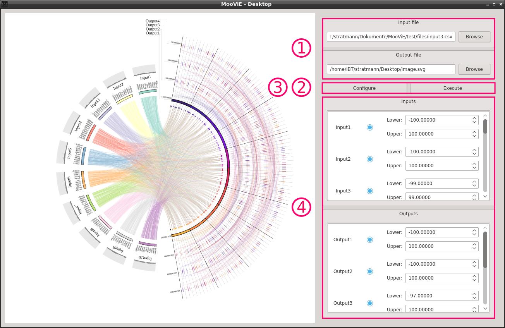
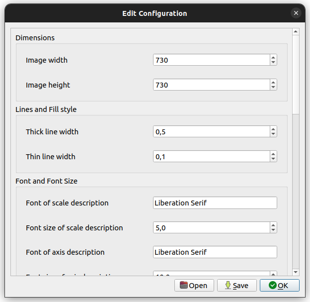
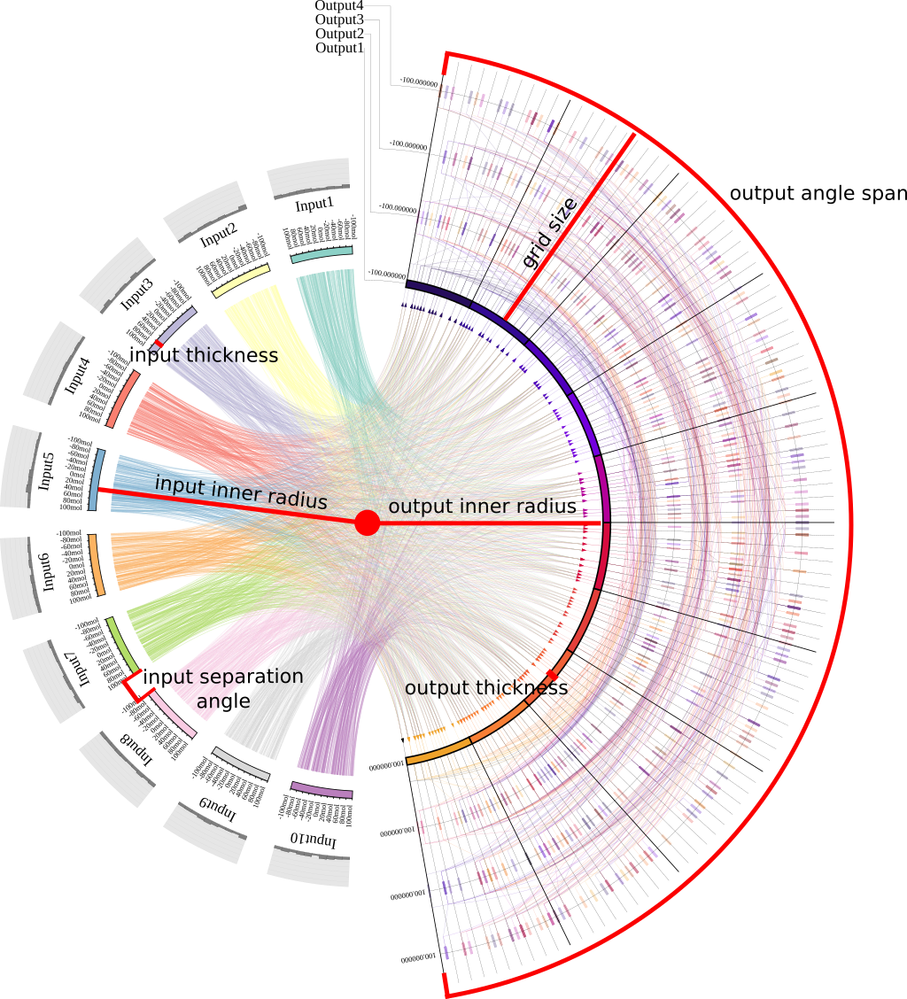

# Multi-objective optimization Visualization Engine

 
The Multi-objective optimization Visualization Engine (MooViE) is developed at 
the Institute of Bio- and Geosciences 1 (IBG-1) of the Forschungszentrum Jülich. MooViE 
is an easy-to-use tool to display multidimensional data. It is designed for 
pareto optima with up to eight optimization criteria.
 
MooViE comes with a simple graphical user interface that allows the user to interactively 
change which data is displayed and configure the style.

### Prerequisites and Dependencies
MooViE currently supports Linux.

Required tools:
* A C++11 capable compiler
* [CMake](http://cmake.org) >= 3.7

Required Libraries:
* _freetype2_
* _sigc++-2.0_
* _cairo_ and _cairomm-1.0_
* _Qt5_ (>= 5.4) with _QtGui_ and _QtWebEngine_

### How to install MooViE

#### Manual
On Debian-based systems you can simply follow the installation steps from the Dockerfile.

#### Docker
First you need to install Docker (for instance by following this [instruction](https://docs.docker.com/engine/install/ubuntu/#install-docker-engine)). On Debian-based systems you can now open a bash console and run
```shell script
./moovie-desktop-docker.sh
```
This will build the Docker image and run it afterwards. For later runs, the script will check if the image is already installed.

### Input Format
The MooViE input file needs to be in CSV format using **commas** as column delimiters. 
Comments begin with **\#**. The first line that is neither a blank line and nor a comment 
is the column header line. Column headers specify the name of the component, its unit 
and if it contains input or criteria (output) values.

The syntax is `i#<input name>[<unit>]` for input headers and `o#<output name>[<unit>]` 
for outputs. If a column name should contain commas or square brackets, it can be masked by 
quotes. Square brackets and units can be omitted. 

It is required that all input columns are followed by all output columns. The table 
cells must not be empty.

### How to use the Command Line Tool
If installed, the `moovie` should be available from the command line. The syntax for 
the command line tool is
```shell
moovie [[OPTION <arg>]...] <input file>
```
When calling MooViE from the command line, an input file _must_ be specified. MooViE 
generates an SVG file that is by default `image.svg` in your current path. The command 
line tool has the following options:

**-o/\-\-output-file** path of the result file [string]

**-x/\-\-width** width of the result image [positive integer]

**-y/\-\-height** height of the result image [positive integer]

**-c/\-\-configuration-file** path of the configuration file [string]

A valid call would be for instance
```shell
moovie -x 750 -y 750 -o ./output.svg -c ./moovie.conf input.csv
```

### How to use the GUI
With MooViE's graphical user interface you can easily configure MooViE and display 
the results.



For running a MooViE scene, an input file and an output (1) need to be specified. 
You can now render the scene with a simple click (2). If the output does not satisfy 
your wishes, you can edit the configuration for the MooViE scene (3). By using the 
column control section (4), you can now alter how and what data is displayed. You can 
navigate in the display area using scroll bars and `ctrl` + `+`/`-`.

You can enable and disable inputs and outputs by a toggle button and enter new boundaries 
for the values in the selected column. The order of columns can also be changed by 
drag-and-drop.



The configuration dialog simplifies editing the configuration for the MooViE scene. 
Configurations also be saved to a file for later and loaded from a file directly 
into the current Scene.

### How to configure MooViE
MooViE has a large amount of configuration values. Some of them are outlined graphically
in the following picture.



If you use MooViE on the command line, you might want to create a custom configuration 
file. A default that you can use as base can be found at `test/files/moovie.conf`. 
A configuration file consists of lines that encode key value pairs. The syntax of such 
a line is `moovie.<key> = <value>`. An example for a valid line is

`moovie.width = 500`.

Blank lines and lines that start with **\#** are 
ignored.

### Detailed configuration value description
Setting image dimensions:
* **width**: the image width [positive integer]
* **height**: the image height [positive integer]

Setting the line widths:
* **thick_line_width**: line width that is used for thick lines [float], _default_ 
  = 0.5
* **thin_line_width**: line width that is used for thin lines [float], _default_ = 
  0.1

Setting font properties:
* **scale_label_font**: font name of scale values [string], _default_ = "Liberation Serif"
* **scale_label_font_size**: font name of the input label [positive integer], _default_ = 
  5
* **axis_label_font**: font name of input labels [string], _default_ = "Liberation Serif"
* **axis_label_font_size**: font name of the input label [positive integer], _default_ = 
  10

Configuring the output grid:
* **output_angle_span**: angle of the output grid in degree [float], _default_ = 160.0
* **output_inner_radius**: distance from the center of the scene to the begin of the 
  output grid [float], _default_ = 160
* **output_thickness**: thickness of the colored axis of the output grid [float], _default_ 
  = 5
* **grid_size**: distance from the colored axis to the end the output grid [float], 
  _default_ = 150
* **num_major_sections_grid**: number of big ticks on the output scale [positive integer], 
  _default_ = 10
* **num_minor_sections_grid**: number of big ticks on the output scale [positive integer], 
  _default_ = 10

Configuring the input axis:
* **input_inner_radius**: distance from the center of the scene to the begin of an 
  input axis [float], _default_ = 160
* **input_thickness**=5
* **input_separation_angle**: angle between two input axis [float], _default_ = 5.0
* **num_major_sections_axis**: number of big ticks on the input scale [positive integer], 
  _default_ = 10
* **num_minor_sections_axis**: number of big ticks on the input scale [positive integer], 
  _default_ = 10

Configuring the input histograms:
* **histograms_enabled**: enables displaying statistical information about the inputs [boolean], 
  _default_ = true
* **num_histogram_classes**: number of classes in the histogram [positive integer], 
  default_ = 10
* **histogram_height**: height of the histogram [float], _default_ = 20.0
* **histogram_background**: RGB value of the histogram background color [float, float, 
  float], _default_ = 0.0, 0.0, 0.0
* **histogram_fill**: RGB value of the histogram class fill color [float, float, float], 
  _default_ = 0.5, 0.5, 0.5

Configuring data rows:
* **relevant_places**: number of decimal places that MooViE will round a table cell 
  to [integer], 
  _default_ = 3

