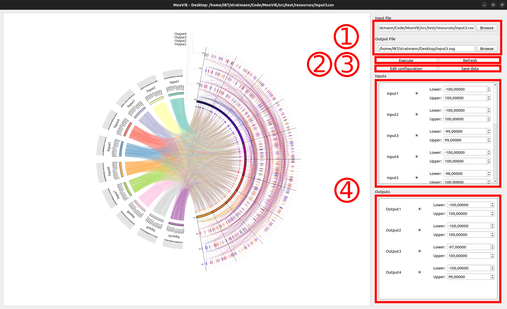
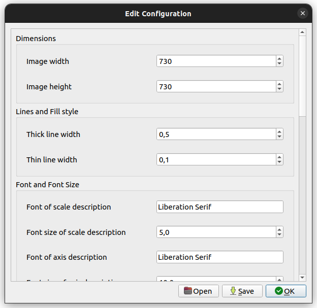

Graphical User Interface
==========

With the graphical user interface, MooViE can be easily configured, results displayed and intermediate states saved. Its
functionality is roughly explained in the following:

(**1**) In order to render a MooViE scene, an input file and an output file need to be specified. (**2**) The rendering process can
then be executed. Also, the data table can be reloaded later. (**3**) To change the visual appearance of the scene, the
configuration can be edited. Modified data sheets can be saved. (**4**) By using the column control section, the way how and
what data is displayed can be controlled. Inputs and outputs can be enabled/disabled by a toggle button and new
variable boundaries can be entered. The order of columns can also be changed by drag-and-drop. 

The configuration dialog simplifies editing the configuration for the MooViE scene. Configurations also be saved to a
file for later and loaded from a file directly into the current scene.
