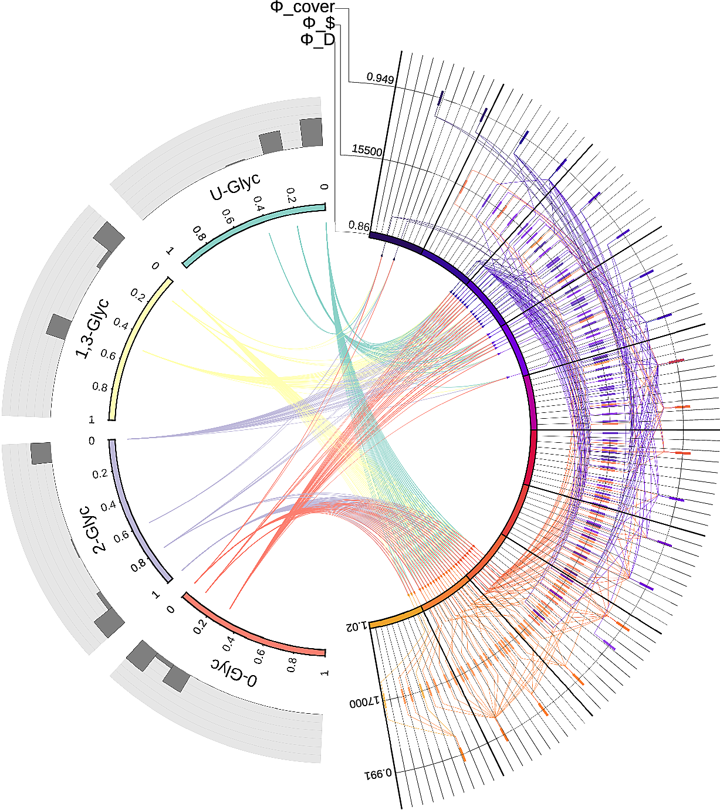

The Multi-objective optimization Visualization Engine (MooViE) is developed at
the Institute of Bio- and Geosciences 1 (IBG-1) of the Forschungszentrum Jülich. MooViE
is an easy-to-use tool to display multidimensional data from all research domains.

MooViE comes with a simple graphical user interface that allows the user to interactively
change which data is displayed and configure the style.